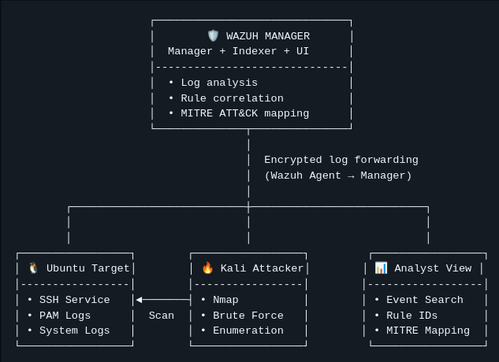

# 🛡 Menarguez-IA SOC Lab
> Detection Engineering | Threat Hunting | MITRE ATT&CK | Blue Team Portfolio


> Hands-on Blue Team lab simulating real-world detection scenarios aligned with MITRE ATT&CK.

Laboratorio práctico de **Security Operations Center (SOC)** orientado a **Blue Team**, diseñado para simular un entorno empresarial real y entrenar tareas de **detección**, **análisis** y **respuesta** a incidentes.

---

## 🏢 Infraestructura simulada

- 🔐 SIEM: **Wazuh**
- 🖥 Endpoint monitorizado: **Ubuntu + Wazuh Agent**
- ⚔ Máquina atacante: **Kali Linux**
- 🌐 Servicio simulado principal: **SSH**
- ⚙ Generación controlada de eventos y telemetría
- 🎯 Casos de uso alineados con **MITRE ATT&CK**

---

## 🎯 Objetivos del laboratorio

- Simular un SOC realista basado en herramientas **open-source**
- Practicar **detección**, **análisis**, **correlación** y **respuesta**
- Documentar casos reales alineados con **MITRE ATT&CK**
- Construir un portfolio técnico demostrable en GitHub
- Validar un flujo completo: **Attack → Logs → SIEM → Hunting → Evidence**

---

## 🏗 Arquitectura (alto nivel)

- **Wazuh SIEM** (Manager + Indexer + Dashboard)
- **Ubuntu Endpoint** (Wazuh Agent + logs de sshd/PAM/system)
- **Kali Attacker** (Nmap + generación de intentos SSH)
- Evidencias y documentación por escenario (A01, A02, …)

---

## 🗺️ Architecture Diagram (Logical View)

### ✅ Visual (screenshot)


### ✅ ASCII (para lectura rápida)

```text
                     ┌──────────────────────────────┐
                     │        🛡️ WAZUH MANAGER      │
                     │  Manager + Indexer + UI      │
                     │------------------------------│
                     │  • Log analysis              │
                     │  • Rule correlation          │
                     │  • MITRE ATT&CK mapping      │
                     └──────────────┬───────────────┘
                                    │
                                    │  Encrypted log forwarding
                                    │  (Wazuh Agent → Manager)
                                    │
        ┌───────────────────────────┼───────────────────────────┐
        │                           │                           │
┌─────────────────┐        ┌─────────────────┐         ┌─────────────────┐
│ 🐧 Ubuntu Target│        │ 🔥 Kali Attacker│        │ 📊 Analyst View  │
│-----------------│        │-----------------│        │------------------│
│ • SSH Service   │◄───────┤ • Nmap          │        │ • Threat Hunting │
│ • PAM Logs      │  Scan  │ • SSH Attempts  │        │ • Rule IDs       │
│ • System Logs   │        │ • Enumeration   │        │ • MITRE Mapping  │
└─────────────────┘        └─────────────────┘         └─────────────────┘

---

🔎 Logical Flow

Kali (Attack)
→ Ubuntu Endpoint (Logs generated)
→ Wazuh Manager (Detection & Correlation)
→ Analyst Dashboard (Threat Hunting)

🔎 Attack Scenarios

Legend: 🎯 Objective · 🖥 Command · 📊 Detection (Rule IDs) · 🧠 MITRE · 📈 Analysis · 🛡 Response

---
## 🔍 A01 – Nmap Reconnaissance

🎯 Objective
Generar tráfico de reconocimiento contra el endpoint monitorizado.

🖥 Command executed (Kali)

sudo nmap -sS -sV -O -Pn -T3 192.168.100.235

---

🧠 MITRE Mapping

T1046 – Network Service Discovery
Referencia oficial: https://attack.mitre.org/techniques/T1046/

📈 Analysis
Los SYN scans (-sS) pueden generar registros limitados en el host porque el handshake TCP no se completa.
Referencia Nmap (fuente oficial): https://nmap.org/book/man-host-discovery.html

📁 Documentation / evidence

attacks/A01_Nmap_Recon/README.md
attacks/A01_Nmap_Recon/nmap_ubuntu_agent.txt

🔥 A02 – SSH Brute Force Detection (non-existent user)

🎯 Objective
Simular intentos repetidos de autenticación SSH usando un usuario inexistente y validar detección/correlación en Wazuh.

🖥 Command executed (Kali)

for i in {1..10}; do ssh fakeuser@192.168.100.235; done

📊 Detection observed (Wazuh Rule IDs)
5710 → Attempt to login using a non-existent user (Level 5)
5503 → PAM: User login failed (Level 5)
2502 → Multiple password failures (Level 10)

🧠 MITRE Mapping

T1110 – Brute Force
Referencia oficial: https://attack.mitre.org/techniques/T1110/

📈 Analysis
Este escenario demuestra:
generación de logs en sshd y PAM
detección por reglas
aumento de severidad al repetirse fallos (escalado)

🛡 Response considerations (SOC)

identificar origen (IP) y patrón temporal
revisar si hay intentos sobre múltiples usuarios
aplicar hardening (Fail2Ban, rate-limits, MFA si aplica, bloqueo por firewall)
buscar actividad posterior (movimiento lateral, sudo, persistencia)

📁 Documentation / evidence

attacks/A02_SSH_BruteForce/README.md

📸 Detection Evidence (Wazuh)
Dashboard overview

---

## SSH brute force detection (A02)

📊 Detection Summary
ID	Scenario	Severity	MITRE
A01	Nmap Reconnaissance	Low	T1046
A02	SSH Brute Force (invalid)	High	T1110
🧠 Capabilities Demonstrated
📄 Log analysis (sshd, PAM, syslog)
🔎 Threat hunting in OpenSearch / Wazuh
🧩 Correlación de eventos y reglas
🚨 Escalado de severidad (Level 5 → Level 10)
🎯 MITRE ATT&CK mapping
📚 Documentación estructurada por escenarios
🛠 Gestión de versiones con Git (commits, historial, evidencias)
---

## 🚀 Upcoming Scenarios

A03 – Hydra brute force simulation
A04 – File Integrity Monitoring (FIM) detection
A05 – Privilege escalation simulation
A06 – Reverse shell detection
A07 – Persistence technique simulation
A08 – Custom Wazuh rule creation

---

## 🎯 Why This Lab Matters

This lab demonstrates real SOC workflow:

- Attack simulation
- Log generation
- SIEM detection
- MITRE alignment
- Evidence documentation
- Analyst investigation mindset

---
📌 Professional Context

Este repositorio forma parte de mi evolución profesional como SOC Analyst / Blue Team Specialist, enfocado en detección, correlación y monitorización de eventos en entornos simulados.
Proyecto desarrollado dentro del ecosistema Menarguez-IA Solutions.

---

## Importante (para que las imágenes se vean)
Tienen que existir exactamente estas rutas en tu repo:

- `docs/images/architecture_diagram.png`
- `docs/images/dashboard_overview.png`
- `docs/images/ssh_bruteforce_detection.png`

En tu captura ya veo que las tienes en `docs/images/`, perfecto.

---

## Y sobre “A01 cuál era”
✅ A01 es el **Nmap Reconnaissance**, el escenario de reconocimiento contra `192.168.100.235`.

---
