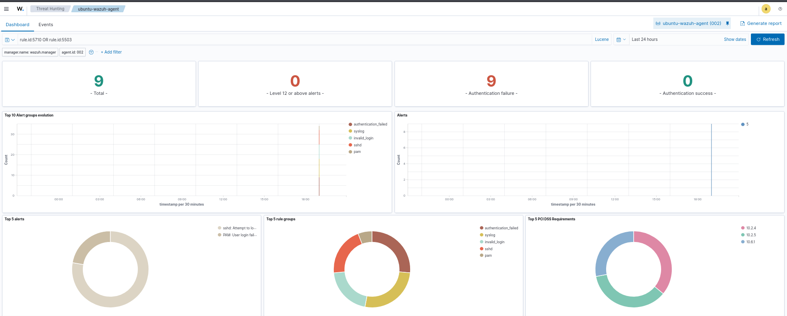
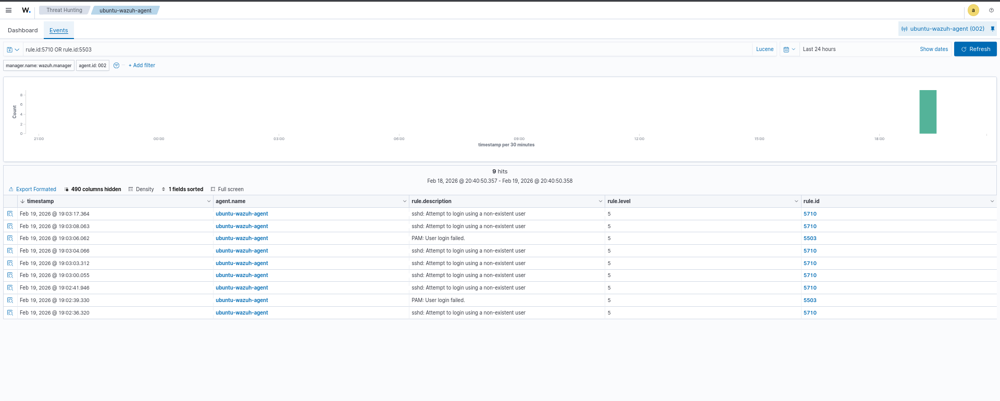

# 🛡 Menarguez-IA SOC Lab

> Detection Engineering | Threat Hunting | MITRE ATT&CK | Blue Team Portfolio


Hands-on Blue Team lab simulating real-world detection scenarios aligned with MITRE ATT&CK.

Laboratorio práctico de **Security Operations Center (SOC)** orientado a **Blue Team**, diseñado para simular un entorno empresarial real y entrenar tareas de detección, análisis y respuesta a incidentes.

---

## 🏢 Infraestructura simulada

- 🔐 SIEM: Wazuh
- 🖥 Endpoint monitorizado: Ubuntu + Wazuh Agent
- ⚔ Máquina atacante: Kali Linux
- 🌐 Servicio simulado principal: SSH
- ⚙ Generación controlada de eventos y telemetría
- 🎯 Casos de uso alineados con MITRE ATT&CK

---

## 🎯 Objetivos del laboratorio

- Simular un SOC realista basado en herramientas open-source
- Practicar detección, análisis, correlación y respuesta
- Documentar casos reales alineados con MITRE ATT&CK
- Construir un portfolio técnico demostrable en GitHub
- Validar un flujo completo: Attack → Logs → SIEM → Hunting → Evidence

---

## 🏗 Arquitectura (alto nivel)

- Wazuh SIEM (Manager + Indexer + Dashboard)
- Ubuntu Endpoint (Wazuh Agent + logs sshd / PAM / system)
- Kali Attacker (Nmap + generación de intentos SSH)
- Evidencias y documentación por escenario (A01, A02, …)

---

## 🗺️ Architecture Diagram (Logical View)

### 📸 Visual


### 🔹 Logical Flow (simplified)

```
Kali (Attack)
      ↓
Ubuntu Endpoint (Logs generated)
      ↓
Wazuh Manager (Detection & Correlation)
      ↓
Analyst Dashboard (Threat Hunting)
```

---

# 🔎 Attack Scenarios

**Legend:**  
🎯 Objective · 🖥 Command · 📊 Detection · 🧠 MITRE · 📈 Analysis · 🛡 Response

---

## 🔍 A01 – Nmap Reconnaissance

### 🎯 Objective
Generate reconnaissance traffic against the monitored endpoint.

### 🖥 Command executed (Kali)

```bash
sudo nmap -sS -sV -O -Pn -T3 192.168.100.235
```

### 🧠 MITRE Mapping
T1046 – Network Service Discovery  
https://attack.mitre.org/techniques/T1046/

### 📈 Analysis
SYN scans (-sS) may generate limited host logs because the TCP handshake is not completed.

Official Nmap reference:  
https://nmap.org/book/man-host-discovery.html

### 📁 Documentation
- attacks/A01_Nmap_Recon/README.md
- attacks/A01_Nmap_Recon/nmap_ubuntu_agent.txt

---

## 🔥 A02 – SSH Brute Force Detection (non-existent user)

### 🎯 Objective
Simulate repeated SSH authentication attempts using a non-existent user.

### 🖥 Command executed (Kali)

```bash
for i in {1..10}; do ssh fakeuser@192.168.100.235; done
```

### 📊 Detection observed (Wazuh Rule IDs)

- Rule 5710 → Attempt to login using a non-existent user (Level 5)
- Rule 5503 → PAM: User login failed (Level 5)
- Rule 2502 → Multiple password failures (Level 10)

### 🧠 MITRE Mapping
T1110 – Brute Force  
https://attack.mitre.org/techniques/T1110/

### 📈 Analysis
This scenario demonstrates:
- Log generation in sshd and PAM
- Rule-based detection
- Severity escalation after repeated failures

### 🛡 Response considerations

- Identify source IP and time pattern
- Check attempts across multiple users
- Apply hardening (Fail2Ban, rate limits, MFA, firewall rules)
- Investigate potential follow-up activity

### 📁 Documentation
- attacks/A02_SSH_BruteForce/README.md

---

## 📸 Detection Evidence (Wazuh)

### Dashboard overview


### SSH brute force detection (A02)


---

## 📊 Detection Summary

| ID  | Scenario                     | Severity | MITRE  |
|-----|------------------------------|----------|--------|
| A01 | Nmap Reconnaissance          | Low      | T1046  |
| A02 | SSH Brute Force (invalid user) | High  | T1110  |

---

## 🧠 Capabilities Demonstrated

- Log analysis (sshd, PAM, syslog)
- Event correlation
- Severity escalation (Level 5 → Level 10)
- Threat hunting in OpenSearch / Wazuh
- MITRE ATT&CK alignment
- Structured incident documentation
- Version control with Git

---

## 🚀 Upcoming Scenarios

- A03 – Hydra brute force simulation
- A04 – File Integrity Monitoring (FIM) detection
- A05 – Privilege escalation detection
- A06 – Reverse shell detection
- A07 – Persistence technique simulation
- A08 – Custom Wazuh rule creation

---

## 🎯 Why This Lab Matters

This lab demonstrates a real SOC workflow:

- Attack simulation
- Log generation
- SIEM detection
- MITRE alignment
- Evidence documentation
- Analyst investigation mindset

---

## 📌 Professional Context

This repository is part of my professional evolution as a SOC Analyst / Blue Team Specialist, focused on detection, correlation and monitoring in simulated enterprise environments.

Developed within the Menarguez-IA ecosystem.
